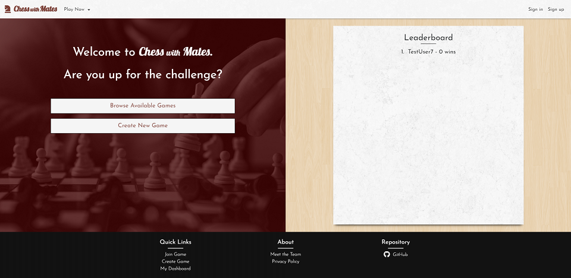
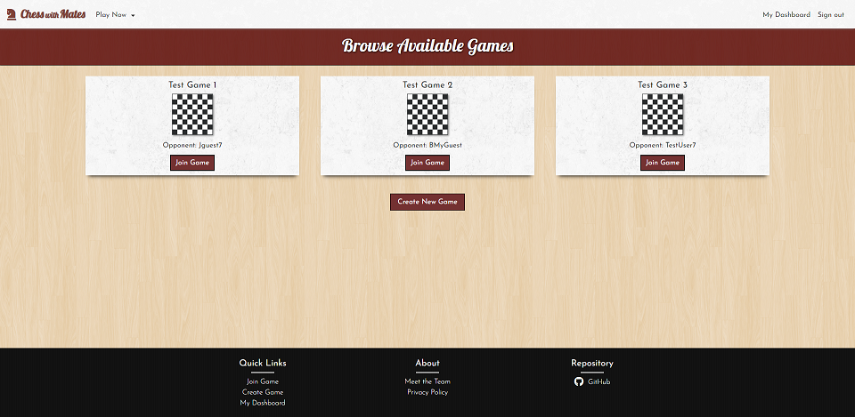
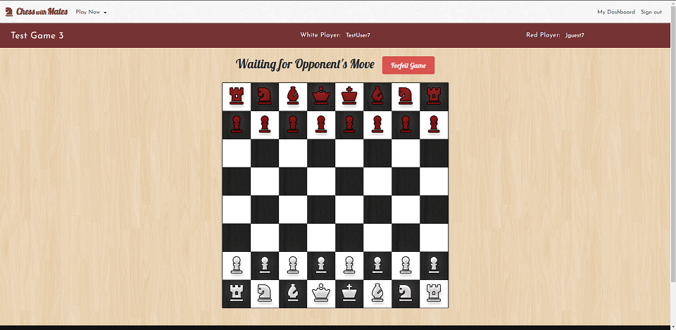
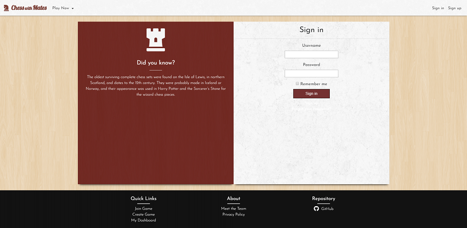

# Chess w/ Mates

A Full Stack fully functional 1v1 Chess Game.

## Browse playable Games

## 1v1 Game Mode

## Authentication

## Deployment

- [https://chesswithmates.herokuapp.com/](https://chesswithmates.herokuapp.com/)

## Tech

- [JavaScript](https://developer.mozilla.org/en-US/docs/Web/JavaScript) v: ES6
- [Ruby](https://www.ruby-lang.org/en/documentation/) v: 2.5.3
- [Rails](https://rubyonrails.org/) - v: 5.2.2
- [postgreSQL](https://www.postgresql.org/) - Database
- [Heroku](https://devcenter.heroku.com/) - Deployment
